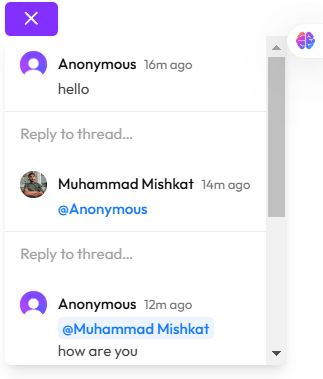

# Loopr | A Collaborative Workspace Application

**Version:** 0.1.0  

## 📚 Project Overview

Loopr is a feature-rich, collaborative workspace application built using Next.js. This project allows users to:
1. Sign up, sign in, and sign out.
2. Create and manage personal or organizational workspaces.
3. Write and collaborate on documents, utilize generative AI for content creation, and much more.  
4. Add comments and receive notifications.  
5. Upload and set cover images for workspaces and documents.

### 🚀 Features

- **User Authentication:** Sign up and sign in with Clerk.js.  
- **Workspace Management:** Create personal or organizational workspaces.  
- **Collaborative Documents:** Create, write, and collaborate in real-time.  
- **Generative AI Support:** Use the Gemini API for AI-assisted writing.  
- **Emoji Picker:** Add emojis to your workspace and documents.  
- **Customizable Covers:** Upload and set cover images for workspaces.  
- **Comments and Notifications:** Add comments and receive notifications.  
- **User-friendly UI:** Minimalistic design using ShadCN, Radix UI and TailwindCSS.

---

## 🛠️ Technologies Used

- **Framework:** [Next.js](https://nextjs.org/) (v14.2.5)
- **UI Components:** TailwindCSS, Radix UI
- **Real-time Collaboration:** Liveblocks
- **Authentication:** Clerk.js
- **Generative AI:** Gemini API
- **Database:** Firebase
- **Editor:** Editor.js

---

## 📋 Prerequisites

Ensure you have the following installed before setting up the project:

1. **Node.js** (v16 or later)
2. **npm** or **yarn**
3. **Firebase Project**
4. **Clerk.js API Keys**
5. **Gemini API Key**

---

## ⚙️ Project Setup

1. Clone the repository:

   ```bash
   git clone https://github.com/tanim-mishkat/Loopr-collaborative-workspace-app.git
   cd loopr
   ```

2. Install dependencies:

   ```bash
   npm install
   ```

3. Set up Firebase:

   - Create a Firebase project.
   - Enable Firestore and Authentication in the Firebase Console.
   - Download the Firebase config and place it in `firebaseConfig.js`.

4. Configure Clerk.js:

   - Sign up for a Clerk.js account.
   - Copy the API keys and paste them into `.env.local`.

5. Add `.env.local` file:

   ```plaintext
   NEXT_PUBLIC_CLERK_FRONTEND_API=your_clerk_frontend_api
   CLERK_API_KEY=your_clerk_api_key
   FIREBASE_API_KEY=your_firebase_api_key
   FIREBASE_AUTH_DOMAIN=your_firebase_auth_domain
   FIREBASE_PROJECT_ID=your_firebase_project_id
   ```

6. Run the development server:

   ```bash
   npm run dev
   ```

   The app will be available at `http://localhost:3000`.

---

# 🖼️ Project Walkthrough

### 1. **Home Page**

The home page allows users to sign up or log in.

#### Sign Up


#### Sign In


---

### 2. **Dashboard**

After login, users can view their personal and organizational workspaces.  


---

### 3. **Workspace Creation**

Users can create a workspace by adding a title, cover image, and emoji.  


---

### 4. **Document Editor**

Within a workspace, users can create and collaborate on documents in real-time.  


---

### 5. **Comments and Notifications**

Users can leave comments and stay updated on workspace activity via notification.

#### Comments



#### Notifications


---

## 📜 Scripts

- `npm run dev` – Starts the development server.
- `npm run build` – Builds the project for production.
- `npm run start` – Starts the production server.
- `npm run lint` – Runs ESLint checks.

---

## 📂 Folder Structure

```
microsoft-loop-clone/
├── components/
│   ├── Auth/
│   ├── Dashboard/
│   ├── Editor/
│   └── Workspace/
├── pages/
│   ├── api/
│   ├── dashboard.js
│   ├── index.js
│   └── workspace/
├── styles/
│   ├── globals.css
│   └── tailwind.css
├── utils/
│   ├── firebaseConfig.js
│   └── liveblocksConfig.js
├── .env.local
├── package.json
└── README.md
```

---

## 🌟 Contributing

Feel free to fork this project and contribute by submitting pull requests. Make sure to adhere to the project's coding standards.

---

## 🛡️ License

This project is licensed under the MIT License. See the LICENSE file for details.

---

## 📧 Contact

If you have any questions or suggestions, feel free to contact the maintainer at [t5mishkat@example.com].

---

Let me know if you need additional details or customization!
